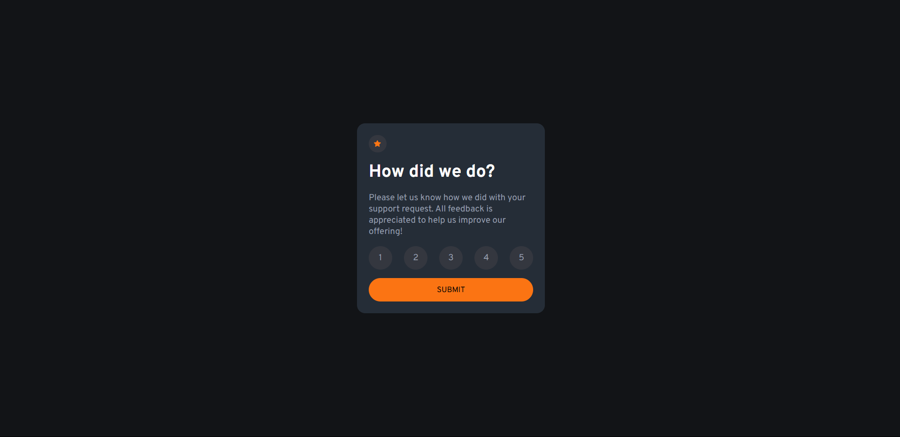

# Frontend Mentor - Interactive rating component 

This is a solution to the [Interactive rating component challenge on Frontend Mentor](https://www.frontendmentor.io/challenges/interactive-rating-component-koxpeBUmI). Frontend Mentor challenges help you improve your coding skills by building realistic projects. 

### The challenge

Users should be able to:

- View the optimal layout for the app depending on their device's screen size
- See hover states for all interactive elements on the page
- Select and submit a number rating
- See the "Thank you" card state after submitting a rating

### Screenshot




### Link

- Live Site URL: [https://heloabrantessb.github.io/interactive-rating-component/](https://heloabrantessb.github.io/interactive-rating-component/)

### Built with

- Semantic HTML5 markup
- CSS custom properties
- Flexbox
- Mobile-first workflow

### What I learned

Learned about localStorage and how it works

```js
localStorage.setItem("rateValue", selected);
```
and how to change the window href using js
```js
window.location.href = "./thankYou.html";
```

## Author
- Frontend Mentor - [@heloabrantessb](https://www.frontendmentor.io/profile/heloabrantessb)

